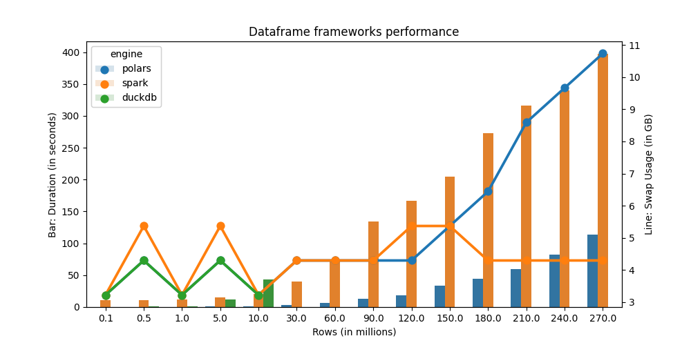

# Dataframe Frameworks Showdown

## Frameworks Used

- ~~pandas~~ (not present in the experiment, because it's very unrealistic to expect pandas to be able to open 15GB data on a 16GB RAM machine)
- polars
- duckdb
- spark (single node)

## Experiments

1. Calculate a timestamp diff column `trip_length_minute`, converted to minute
2. Create percentile on `trip_length_minute` as `trip_length_minute_percentile`
3. Filter only `trip_length_minute_percentile` between (0.2, 0.8)
4. Group by on `VendorID`, `payment_type`
5. Aggregate min, max, avg on `passenger_count`, `trip_distance`, `total_amount`

| framework | mode    | remarks                                          |
| --------- | ------- | ------------------------------------------------ |
| polars    | lazy    | by default, polars does not operate in lazy mode |
| duckdb    | default | -                                                |
| spark     | default | -                                                |

## Compute specs

- CPU: M1 `MacBook Air (M1, 2020)`
- RAM: 16GB

## Data source

See [here](src/utils/download_dataset.sh).

- total size: `15 GB`,
- total records: `1,195,313,202 - around 1200 million rows`
- partitions: `year 2012` to `year 2022` (older partitions have different schema)
- **dirty data**: some columns have mismatched data types across partitions

These will be partitioned and used for experiments. See [here](src/utils/prep_data_01_cast_dtype.py) and [here](src/utils/prep_data_02_repartition.py).

## Usage

```bash
# download data
make download-data

# run experiments
make run
```

## Results

- `duckdb` crash/unrespond at 120,000,000 records (task terminated by user at 14 minute)


